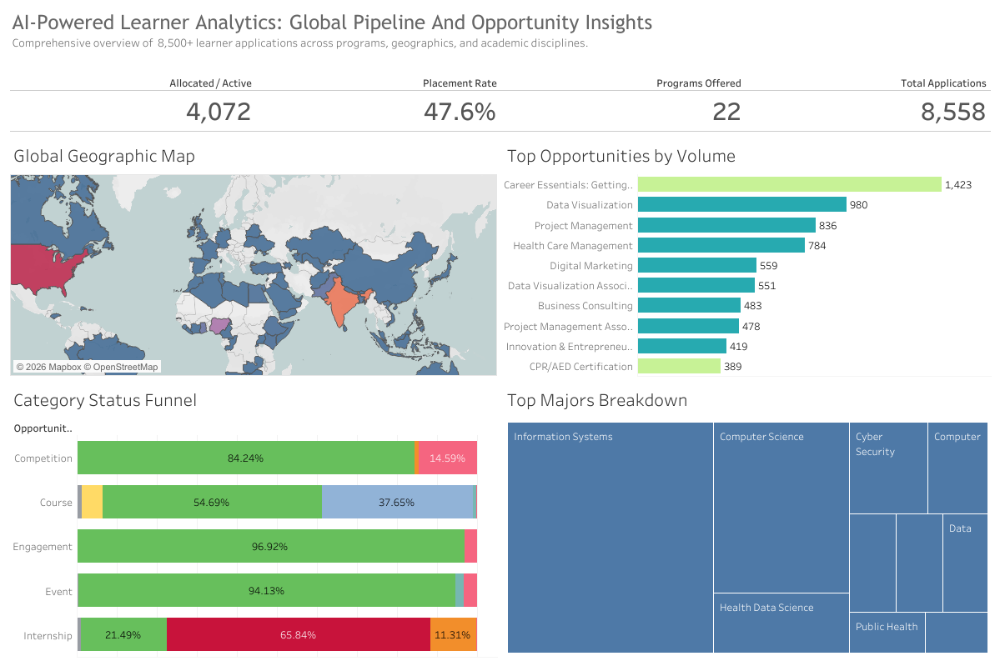

# 🎓 AI-Powered Data Analysis: Global Learner & Opportunity Insights

An automated analytics pipeline built in Python to ingest, process, and summarize global student participation data. This project analyzes a dataset containing over 8,500 registration entries to identify baseline student conversion patterns across various educational categories and global geographic landscapes.

---
## 👥 Team Members

* **Rishitha Yamasani**
* **Esha Joshi**
* **Syed Abrar**
* **Sanskar Muneshwar**
* **Segun Caxton-Martins**
* **Omoge Oluwatosin Emmanuel**
* **Yuveer**
* **Rishi Nagari**

---

## 🚀 Key Features

* **Automated Data Ingestion:** Seamlessly reads and handles raw global registration datasets.
* **Data Processing Pipeline:** Cleanses missing entries, standardizes geographical fields, and formats categorical columns.
* **Advanced Analytics:** Computes conversion rates, retention patterns, and category-wise participation metrics.
* **Insights & Reporting:** Generates high-level statistical summaries and trends for strategic decision-making.

---

## 📊 Core Baseline Statistics

Our initial data overview surfaced the following high-level participation trends:

* **Total Registrations:** Over 8,500 global entry points processed.
* **Geographical Distribution:** High concentrations of diversity across multiple continents, illustrating varying continental engagement levels.
* **Conversion Trends:** Distinct baselines discovered between standard educational categories and professional upskilling registrations.

*(Note: Add specific statistical breakdowns, metrics, or graphs here as they become available!)*

---

## 🛠️ Technical Stack & Dependencies

* **Language:** Python 3.8+
* **Libraries:** `pandas`, `numpy` (Data Processing), `matplotlib`, `seaborn` (Visualization)

---

## ⚙️ Getting Started

### 1. Clone the Repository
```bash
git clone [https://github.com/your-organization/AI-Data-Team-15.git](https://github.com/your-organization/AI-Data-Team-15.git)
cd AI-Data-Team-15

### 2.RIT Opportunity Wise — End-to-End Analytics Pipeline

This repository hosts the production-ready automated data engineering and machine learning pipeline developed for the "RIT Opportunity Wise" interaction dataset.

## Core Contents
* `/src/data_cleaning.py`: Deterministic token standardization, null vector isolation, and datetime normalization engine.
* `/src/eda_visualization.py`: Automated cross-tabulation routines and 300 DPI chart generation scripts (heatmaps, line trends, pie charts).
* `/src/modeling_pipeline.py`: Supervised classifiers (Decision Tree, Random Forest, Weighted Logistic Regression) incorporating stratified target splitting and class imbalance mitigation strategies.
* `/outputs/`: Exported technical chart graphics and performance index matrices.

```

## 📊 Interactive Tableau Dashboard

[]

> 🔗 **[Click here to view and interact with the live dashboard on Tableau Public](https://public.tableau.com/shared/CR84SDCQ2?:display_count=n&:origin=viz_share_link)**

---

## 📌 Executive Summary & Key Metrics

* **Total Applications Analyzed:** 8,558
* **Active / Allocated Placements:** 4,072 (47.58% global placement rate)
* **Program Offerings:** 22 unique opportunities across 5 tracks (Internships, Courses, Events, Competitions, Engagements)
* **Geographic Reach:** 71 countries represented, with primary applicant hubs in the United States (3,976), India (2,836), and Nigeria (760).

---

## 🔍 Analytical Insights

* **Funnel Efficiency by Track:** Internships generated the highest aggregate volume but maintained a competitive 21.5% allocation rate and a 65.8% rejection rate. Conversely, foundational courses recorded placement rates exceeding 90%.
* **Academic Discipline Demand:** Applications were heavily concentrated in technical majors, led by **Information Systems** (2,158) and **Computer Science** (1,052).
* **High-Demand Programs:** The top programs by application volume were *Career Essentials* (1,423), *Data Visualization* (980), *Project Management* (836), and *Health Care Management* (784).

---

## 🛠️ Tech Stack & Tools

* **Business Intelligence:** Tableau Desktop / Tableau Public
* **Database & Querying:** MySQL Workbench (Relational modeling, multi-table joins, aggregations)
* **Data Processing:** Python (Pandas), Google Sheets
* **Version Control:** Git & GitHub

---

## 📂 Repository Structure

* `/data`: Source CSV datasets.
* `/sql`: SQL query scripts organized by milestone and capstone analysis.
* `/dashboard`: Packaged Tableau workbook (`.twbx`) and visual previews.
